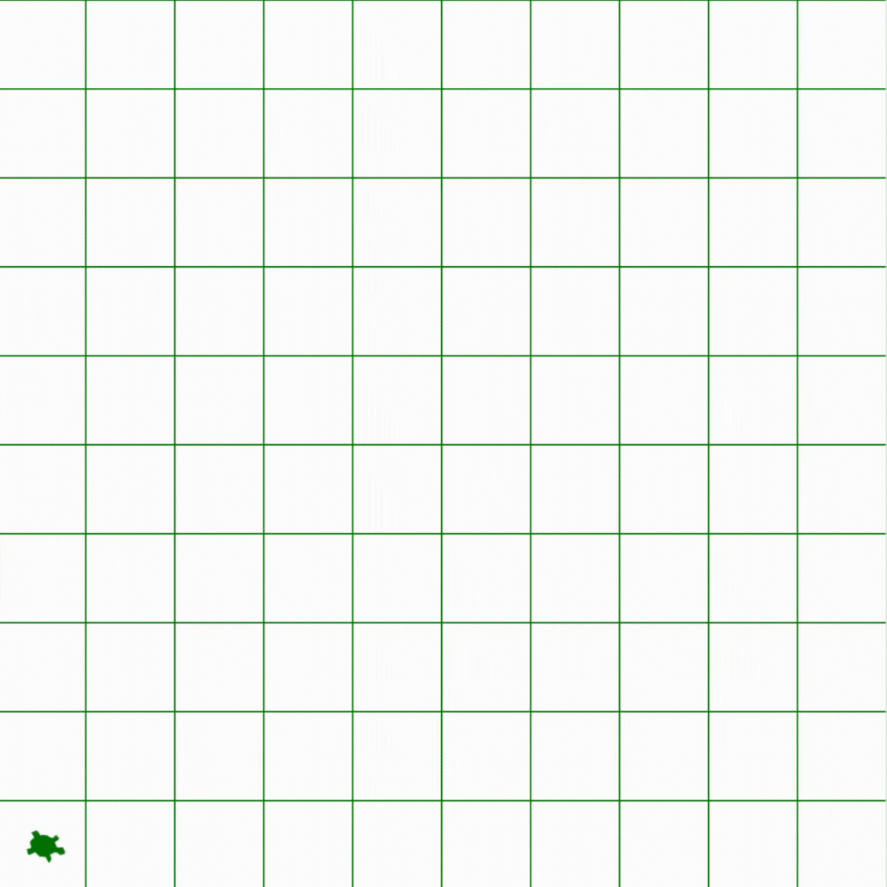

# Robot-Language-Compiler

This is the README file for the Robot-Language-Compiler project. Below, you will find a description of the project, the constraints of the robot, and the grammar used in the programming language.

## Project Description

The Robot-Language-Compiler project focuses on developing a compiler for a programming language designed to control a robot on a two-dimensional field. The robot has two supported instructions: MOV (move) and TURN. The field on which the robot will move is a 2-D square matrix of 10 blocks implemented in Python.

The compiler ensures that the instructions are valid and polite, and it displays an error message if the robot goes beyond the boundaries of the matrix.

## Robot Constraints

    Only 2 supported instructions: MOV and TURN.
    The field on which the robot moves is a 2-D square matrix of 10 blocks implemented in Python.
    If the instruction leads the robot out of the boundaries of the matrix, the CPU should return an illegal instruction error.

## Polite Programming Language

The programming language used to control the robot must be polite and follow certain grammar rules. Here are some examples of valid and invalid sentences:
### Examples of valid sentences:

    "Robot, please move 2 blocks ahead."
    "Robot, please move 3 blocks ahead and then turn 90 degrees. Then, move 2 blocks."
    "Robot, kindly turn 90 degrees and then move 2 steps, and then turn 270 degrees to the right."
    "Robot, please move 3 blocks ahead, then turn 180 degrees to the right, and finally move 2 steps."
    "Please kindly turn 270 degrees to the right, then move 5 blocks ahead and turn 90 degrees."

### Examples of invalid sentences:

    "Robot moves 2 blocks."
    "Robot moves 2 blocks quickly."
    "Move 2 blocks right now."
    "Robot 2 blocks moves."
    "Moves Robot 2 blocks and turn 89 degrees."
    "Move 2 blocks ahead, then turn 90 degrees."
    "Robot, please move 2 blocks quickly and then turn."

## Grammar

Below is the grammar used in the robot programming language:

```<SENTENCES>     ::= <SENTENCE> <SENTENCES> | <SENTENCE>```

```<SENTENCE>      ::= <SUBJECT> <POLITE WORD> <INSTRUCTIONS> | <POLITE WORD> <SUBJECT> <INSTRUCTIONS>```

```<INSTRUCTIONS>  ::= <INSTRUCTION> | <INSTRUCTION> <UNION> <INSTRUCTIONS>```

```<INSTRUCTION>   ::= <MOVE_ACTION> <NUMBER> <MOVE_UNIT> <MOVE_ADVERB> | <TURN_ACTION> <DEGREES> <TURN_UNIT> <TURN_ADVERB> | <MOVE_ACTION> <NUMBER> <MOVE_UNIT> | <TURN_ACTION> <DEGREES> <TURN_UNIT>```

```<SUBJECT>       ::= Robot```

```<POLITE WORD>   ::= please```

```<COMMA>         ::= ,```

```<AND>           ::= and```

```<THEN>          ::= then```

```<UNION>         ::= COMMA AND THEN | COMMA AND | COMMA THEN | COMMA | AND THEN | THEN | AND```

```<NUMBER>        ::= 1|2|3|4|5|6|7|8|9```

```<DEGREES>       ::= 90|180|270|360```

```<MOVE_ACTION>   ::= move | advance | travel | go | proceed```

```<TURN_ACTION>   ::= turn | rotate | spin | pivot | twist | shift```

```<MOVE_UNIT>     ::= blocks | steps```

```<TURN_UNIT>     ::= degrees```

```<MOVE_ADVERB>   ::= ahead```

```<TURN_ADVERB>   ::= to the right | clockwise```


